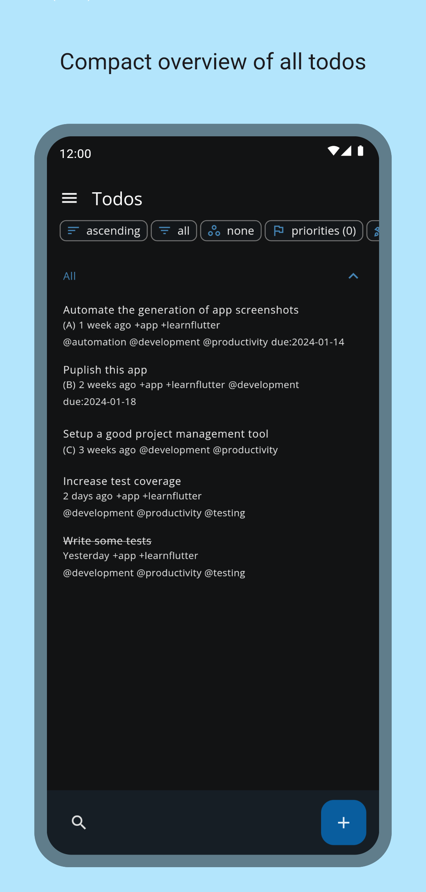
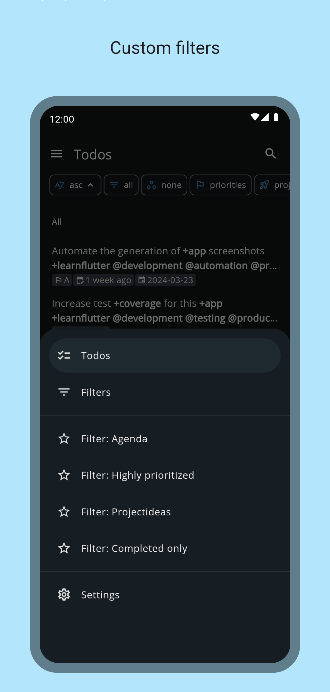
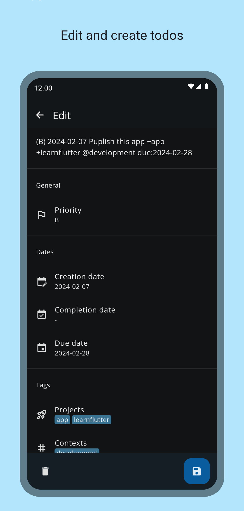
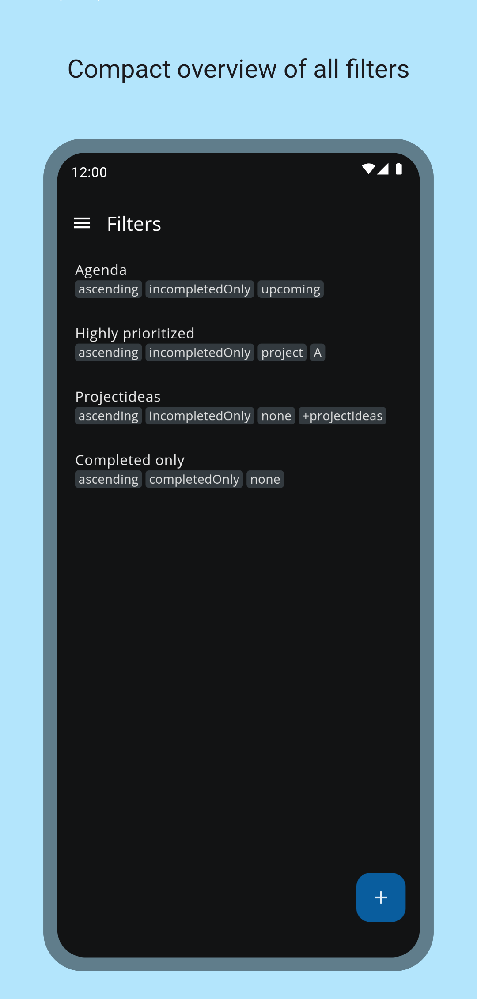
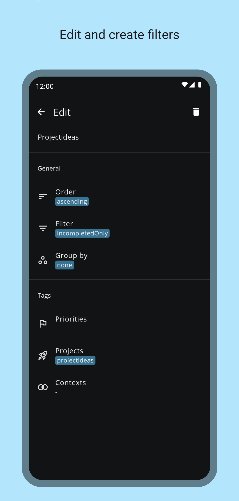

# ntodotxt

[](https://github.com/tmaegel/ntodotxt/actions/workflows/ci.yaml)
[](https://github.com/tmaegel/ntodotxt/releases)
[](https://f-droid.org/packages/de.tnmgl.ntodotxt)
[](https://opensource.org/licenses/MIT)
[](https://github.com/flutter/flutter)

With `ntodotxt` you can manage your todos in a [todo.txt](https://github.com/todotxt/todo.txt) file (i.e. all information
is stored in a single file). You can save your todos locally on your device and/or synchronize the todo.txt file via webdav - for
example with a self-hosted nextcloud instance.

This application is under active development and will continue to be modified and improved over time.

## Downloads

<a href="https://f-droid.org/packages/de.tnmgl.ntodotxt"></a>

## Screenshots

<a href="https://raw.githubusercontent.com/tmaegel/ntodotxt/HEAD/screenshots/preview/1.png"></a>
<a href="https://raw.githubusercontent.com/tmaegel/ntodotxt/HEAD/screenshots/preview/2.png"></a>
<a href="https://raw.githubusercontent.com/tmaegel/ntodotxt/HEAD/screenshots/preview/3.png"></a>
<a href="https://raw.githubusercontent.com/tmaegel/ntodotxt/HEAD/screenshots/preview/4.png"></a>
<a href="https://raw.githubusercontent.com/tmaegel/ntodotxt/HEAD/screenshots/preview/5.png"></a>

## Features

- Manage your todos in [todo.txt](https://github.com/todotxt/todo.txt) format
- Manage your todos locally and/or synchronize your todos via webdav with a server of your choice
- Custom path and filename of todo files (local and remote)
- Completely customizable filters
  - Ordering
  - Filter by project, context, priorities and completion
- Search todos

## Planned features

- Build and publish to Google Play (Android)
- Build and publish as `flatpak` to [flathub](https://flathub.org/) (Linux)
- Build and publish as `snap` to [snapcraft](https://snapcraft.io/) (Linux)
- Build and publish to Microsoft Store (Windows)
- Add language localization (e.g. english, german)
- Import existing todos from file
- Export todos to file
- Archiving of completed todos (done.txt)
- [Recurring](https://c306.net/t/topydo-docs/#Recurrence) tasks

## Build

[Flutter SDK](https://docs.flutter.dev/get-started/install) is required to build this project.

```bash
flutter pub get
flutter run  # debug version
flutter build  # release version
```

## Requirements

- [Nextcloud](https://nextcloud.com/) instance or other webdav server running (**webdav-sync only**)

## Alternatives

There are other note taking apps with the WebDAV support.
See them in [awesome WebDAV list](https://github.com/WebDAVDevs/awesome-webdav/blob/main/readme.md#android-other-apps)

## Troubleshoot

### Prevent the file path of todo.txt from being automatically reset

#### One UI Core (Samsung)

- Open `Settings`
- Go to `Battery and device care` > `More options` (three dots at top right corner) > `Storage booster` > Toggle off `Auto delete unnecessary data` .
